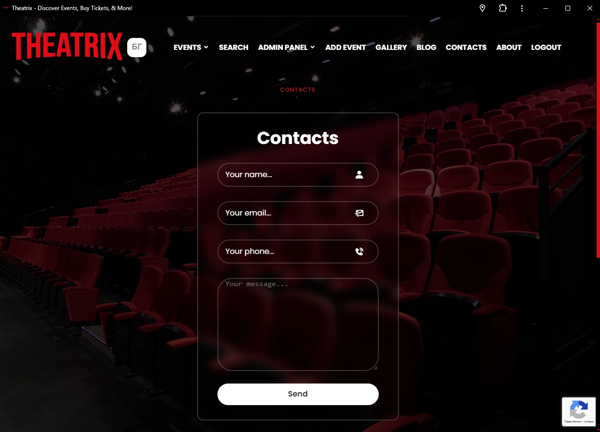

  
  
  

 
   

<h2 align="center">Theatrix ─ a Netflix Inspired Theater And Concert Events App</h2>

  Theatrix is a Netflix inspired theater and concert event app,

  a playground project build with modern technologies

  Its using my Theatrix-HTML-template as a base

  Fully responsible, built using HTML, CSS and JavaScript.

  
  

## ABOUT

**Theatrix** is a place for event holders represented as admins and customers in face of users that can interact seamlessly..

Theatrix as a **PWA (Progressive Web App)** can be seen in action at this address:

https://theatrix-vue.vercel.app

## PROJECT HIGHLIGHTS

* Vue app + PWA (Progressive Web App)
* Cookies so users dont have to login everytime..
* Personalised/User driven home page thats using registered users location or their geo-location
* GEO location for guest users for personalised event page even for non-registered users!
* Filter events by city on the go
* CRUD/Search/Pagination/..
* QR code for every event page for quick send to mobile device
* Admin system - monitoring users (registration ip, login ip, registration date, login date, LIVE ONLINE status)
* Advanced Comment system
* Messaging System (users and guests can send message to admins for questions etc)
* Bulletin System (users can subscribe and unsubscribe at will)
* Multilanguage

## TECHNOLOGIES

### Server:

* bcrypt
* cookie-parser
* cors
* express
* jsonwebtoken
* mongodb
* mongoose

### Client:

* vue
* vuelidate
* pinia
* js-cookie
* jwt-decode
* qrcode.vue
* i18next
* i18next-browser-languagedetector
* vue-recaptcha
* sweetalert2

## ACTIONS

### Administrators:

* **Event Management:** Administrators can easily create, edit, and delete events such as concerts and theater performances.
* **Highlighting Important Events:** They have the option to feature important events on the first page using a pin button.
* **Monitoring Tools:** Administrators can monitor user interactions, including tracking purchases and the number of purchases made for marketing purposes (TODO). They can also view user IP addresses during registration and last login ip, as well as registration and last login dates, including their city and email, for further marketing insights. Can track which user is online (live). Can receive messages from contact form. Can track subscribers + unsubscribe on users request if user is unable to unsubscribe for some reason.

### Users:

* **Event Browsing:** Users can explore theater and concert events by category, search individually, and filter results by category, city, and year.
* **Location based experience:** Upon entering the site will be able to allow access to their location which will display only events in their city or close to their city.
* **Personalized Homepage:** Upon registration, users are redirected to a user drived, personalized homepage showcasing top-rated and local theater and concert events.
* **Profile Management:** In their profile page, users can view and manage* (remove likes and buy tickets directly for liked events TODO) their liked events and track recent purchases.
* **Ticket Purchase:** Users can buy tickets directly for events they are interested in, and they can also see how many tickets are left for a particular event.

**Additional Features:**

* **QR Code Integration:** Every user, admin or guest can see in right corner of every theater or concert event page a QR Code badge that can scan and so he can quickly sent that associated event page to their mobile device like phone or tablet so they can tranfer their journey on the go quickly.
* **Geolocation Functionality:** Geolocation functionality for guests allows location-based services for non-registered users and thuse enriching their experience. There is also plans for IP geolocation but its postponed as of now since mobile data isnt realiable for users location.

## HOW TO

### Server

* npm i
* npm start

### Client

* npm i
* npm dev start on http://192.168.56.1:5173/. To test progressive web app and geo-location you will need secure connection (https://)

### Notes

**🔴 TO ADD YOURSELF AS ADMIN, ADD YOUR IP ADDRESS IN ENV FILE ON SERVER => exports.ADMIN_IP_ADDRESS = "your.ip.address.here"**,

then proceed with registration.

## THEATRIX REST API Endpoints:

Server and client are configured to work on localhost. Server (Express REST API) is accessible from http://localhost:3000 and client (Vue) from http://192.168.56.1:5173 (default ports).

<table style="width: 804px;">
<thead>
<tr style="height: 42px;">
<th style="height: 42px; width: 151.367px;">Endpoint</th>
<th style="height: 42px; width: 18.6333px;" align="center">HTTP Method</th>
<th style="height: 42px; width: 408px;">Description</th>
<th style="height: 42px; width: 73px;" align="center">Guests Access?</th>
<th style="height: 42px; width: 74px;" align="center">Admins Access?</th>
<th style="height: 42px; width: 72px;" align="center">Users Access?</th>
</tr>
</thead>
<tbody>
<tr style="height: 212px;">
<td style="height: 212px; width: 151.367px;">/</td>
<td style="height: 212px; width: 18.6333px;" align="center">GET</td>
<td style="height: 212px; width: 408px;">

Retrieves Pinned Events (manually put by admins), Latest Theater Events, Latest Concert Events, All Time Top Rated Events***

 

***Accessed by Logged-in users or guests which allowed geo-location, becomes strongly personalised page. It displays theater events, concert events and top rated events based on users location (using city from registration or geo-location if allowed and aplicable*)

</td>
<td style="height: 212px; width: 73px;" align="center">✔️</td>
<td style="height: 212px; width: 74px;" align="center">✔️</td>
<td style="height: 212px; width: 72px;" align="center">✔️</td>
</tr>
<tr style="height: 22px;">
<td style="height: 22px; width: 151.367px;">/search</td>
<td style="height: 22px; width: 18.6333px;" align="center">GET</td>
<td style="height: 22px; width: 408px;">Retrieves all events by default</td>
<td style="height: 22px; width: 73px;" align="center">❌</td>
<td style="height: 22px; width: 74px;" align="center">✔️</td>
<td style="height: 22px; width: 72px;" align="center">✔️</td>
</tr>
<tr style="height: 49px;">
<td style="height: 49px; width: 151.367px;">/search</td>
<td style="height: 49px; width: 18.6333px;" align="center">POST</td>
<td style="height: 49px; width: 408px;">Retrieves search results initialised from user by name, category, year or event type</td>
<td style="height: 49px; width: 73px;" align="center">❌</td>
<td style="height: 49px; width: 74px;" align="center">✔️</td>
<td style="height: 49px; width: 72px;" align="center">✔️</td>
</tr>
<tr style="height: 22px;">
<td style="height: 22px; width: 151.367px;">/contacts</td>
<td style="height: 22px; width: 18.6333px;" align="center">GET</td>
<td style="height: 22px; width: 408px;">Retrieves contacts page</td>
<td style="height: 22px; width: 73px;" align="center">✔️</td>
<td style="height: 22px; width: 74px;" align="center">✔️</td>
<td style="height: 22px; width: 72px;" align="center">✔️</td>
</tr>
<tr style="height: 22px;">
<td style="height: 22px; width: 151.367px;">/about</td>
<td style="height: 22px; width: 18.6333px;" align="center">GET</td>
<td style="height: 22px; width: 408px;">Retrieves about page</td>
<td style="height: 22px; width: 73px;" align="center">✔️</td>
<td style="height: 22px; width: 74px;" align="center">✔️</td>
<td style="height: 22px; width: 72px;" align="center">✔️</td>
</tr>
<tr style="height: 22px;">
<td style="height: 22px; width: 151.367px;">/profile</td>
<td style="height: 22px; width: 18.6333px;" align="center">GET</td>
<td style="height: 22px; width: 408px;">Retrieves all events that user purchased or liked in form of visual representation</td>
<td style="height: 22px; width: 73px;" align="center">❌</td>
<td style="height: 22px; width: 74px;" align="center">❌</td>
<td style="height: 22px; width: 72px;" align="center">✔️</td>
</tr>
<tr style="height: 22px;">
<td style="height: 22px; width: 151.367px;">/users</td>
<td style="height: 22px; width: 18.6333px;" align="center">GET</td>
<td style="height: 22px; width: 408px;">Retrieves all users with information about their _id, username, email, city, registration ip address, last login ip address, registration date and last login date</td>
<td style="height: 22px; width: 73px;" align="center">❌</td>
<td style="height: 22px; width: 74px;" align="center">✔️</td>
<td style="height: 22px; width: 72px;" align="center">❌</td>
</tr>
<tr style="height: 22px; background-color: red;">
<td style="height: 22px; width: 151.367px;">                 T</td>
<td style="height: 22px; width: 18.6333px;" align="center">H</td>
<td style="height: 22px; width: 408px;">              E               A                 T</td>
<td style="height: 22px; width: 73px;" align="center">R</td>
<td style="height: 22px; width: 74px;" align="center">I</td>
<td style="height: 22px; width: 72px;" align="center">X</td>
</tr>
<tr style="height: 42px;">
<td style="height: 42px; width: 151.367px;">/events/</td>
<td style="height: 42px; width: 18.6333px;" align="center">GET</td>
<td style="height: 42px; width: 408px;">Retrieves all theater and concert events</td>
<td style="height: 42px; width: 73px;" align="center">✔️</td>
<td style="height: 42px; width: 74px;" align="center">✔️</td>
<td style="height: 42px; width: 72px;" align="center">✔️</td>
</tr>
<tr style="height: 42px;">
<td style="height: 42px; width: 151.367px;">/events/theater</td>
<td style="height: 42px; width: 18.6333px;" align="center">GET</td>
<td style="height: 42px; width: 408px;">Retrieves all theater events</td>
<td style="height: 42px; width: 73px;" align="center">✔️</td>
<td style="height: 42px; width: 74px;" align="center">✔️</td>
<td style="height: 42px; width: 72px;" align="center">✔️</td>
</tr>
<tr style="height: 22px;">
<td style="height: 22px; width: 151.367px;">/events/concerts</td>
<td style="height: 22px; width: 18.6333px;" align="center">GET</td>
<td style="height: 22px; width: 408px;">Retrieves all concert events</td>
<td style="height: 22px; width: 73px;" align="center">✔️</td>
<td style="height: 22px; width: 74px;" align="center">✔️</td>
<td style="height: 22px; width: 72px;" align="center">✔️</td>
</tr>
<tr style="height: 22px;">
<td style="height: 22px; width: 151.367px;">/events/add</td>
<td style="height: 22px; width: 18.6333px;" align="center">GET</td>
<td style="height: 22px; width: 408px;">Retrieves form for registering/adding new event</td>
<td style="height: 22px; width: 73px;" align="center">❌</td>
<td style="height: 22px; width: 74px;" align="center">✔️</td>
<td style="height: 22px; width: 72px;" align="center">❌</td>
</tr>
<tr style="height: 22px;">
<td style="height: 22px; width: 151.367px;">/events/add</td>
<td style="height: 22px; width: 18.6333px;" align="center">POST</td>
<td style="height: 22px; width: 408px;">Adds/Creates new event</td>
<td style="height: 22px; width: 73px;" align="center">❌</td>
<td style="height: 22px; width: 74px;" align="center">✔️</td>
<td style="height: 22px; width: 72px;" align="center">❌</td>
</tr>
<tr style="height: 22px;">
<td style="height: 22px; width: 151.367px;">/events/:eventId</td>
<td style="height: 22px; width: 18.6333px;" align="center">GET</td>
<td style="height: 22px; width: 408px;">Retrieves details page for associated event</td>
<td style="height: 22px; width: 73px;" align="center">✔️</td>
<td style="height: 22px; width: 74px;" align="center">✔️</td>
<td style="height: 22px; width: 72px;" align="center">✔️</td>
</tr>
<tr style="height: 22px;">
<td style="height: 22px; width: 151.367px;">/events/:eventId</td>
<td style="height: 22px; width: 18.6333px;" align="center">PUT</td>
<td style="height: 22px; width: 408px;">Retrieves form for editing associated event</td>
<td style="height: 22px; width: 73px;" align="center">❌</td>
<td style="height: 22px; width: 74px;" align="center">✔️</td>
<td style="height: 22px; width: 72px;" align="center">❌</td>
</tr>
<tr style="height: 22px;">
<td style="height: 22px; width: 151.367px;">/events/:eventId</td>
<td style="height: 22px; width: 18.6333px;" align="center">DELETE</td>
<td style="height: 22px; width: 408px;">Removes/Deletes associated event</td>
<td style="height: 22px; width: 73px;" align="center">❌</td>
<td style="height: 22px; width: 74px;" align="center">✔️</td>
<td style="height: 22px; width: 72px;" align="center">❌</td>
</tr>
<tr style="height: 22px;">
<td style="height: 22px; width: 151.367px;">/events/:eventId/like</td>
<td style="height: 22px; width: 18.6333px;" align="center">POST</td>
<td style="height: 22px; width: 408px;">Performs like action, increases event and user likes +1, retrieves total likes</td>
<td style="height: 22px; width: 73px;" align="center">❌</td>
<td style="height: 22px; width: 74px;" align="center">❌</td>
<td style="height: 22px; width: 72px;" align="center">✔️</td>
</tr>
<tr style="height: 22px;">
<td style="height: 22px; width: 151.367px;">/events/:eventId/unlike</td>
<td style="height: 22px; width: 18.6333px;" align="center">POST</td>
<td style="height: 22px; width: 408px;">Removes like action, descreases event and user likes -1, hides total likes</td>
<td style="height: 22px; width: 73px;" align="center">❌</td>
<td style="height: 22px; width: 74px;" align="center">❌</td>
<td style="height: 22px; width: 72px;" align="center">✔️</td>
</tr>
<tr style="height: 42px;">
<td style="height: 42px; width: 151.367px;">/events/:eventId/pin</td>
<td style="height: 42px; width: 18.6333px;" align="center">POST</td>
<td style="height: 42px; width: 408px;">Adds associated event _id to pinned array (adds event to home page in Pinned Events section)</td>
<td style="height: 42px; width: 73px;" align="center">❌</td>
<td style="height: 42px; width: 74px;" align="center">✔️</td>
<td style="height: 42px; width: 72px;" align="center">❌</td>
</tr>
<tr style="height: 22px;">
<td style="height: 22px; width: 151.367px;">/events/:eventId/unpin</td>
<td style="height: 22px; width: 18.6333px;" align="center">POST</td>
<td style="height: 22px; width: 408px;">Removes associated event _id from pinned array (removes event from home page Pinned Events section)</td>
<td style="height: 22px; width: 73px;" align="center">❌</td>
<td style="height: 22px; width: 74px;" align="center">✔️</td>
<td style="height: 22px; width: 72px;" align="center">❌</td>
</tr>
<tr style="height: 22px;">
<td style="height: 22px; width: 151.367px;">/events/:eventId/buy</td>
<td style="height: 22px; width: 18.6333px;" align="center">POST</td>
<td style="height: 22px; width: 408px;">Adds associated event _id to bought and owner array, decreases tickets count -1. (User buys ticket for associated event, increases user's bought list +1, decreases event total tickets -1</td>
<td style="height: 22px; width: 73px;" align="center">❌</td>
<td style="height: 22px; width: 74px;" align="center">❌</td>
<td style="height: 22px; width: 72px;" align="center">✔️</td>
</tr>
<tr style="height: 22px;">
<td style="height: 22px; width: 151.367px;">/events/user</td>
<td style="height: 22px; width: 18.6333px;" align="center">GET</td>
<td style="height: 22px; width: 408px;">Endpoint for geo-location api WIP</td>
<td style="height: 22px; width: 73px;" align="center"><strong>-</strong></td>
<td style="height: 22px; width: 74px;" align="center"><strong>-</strong></td>
<td style="height: 22px; width: 72px;" align="center"><strong>-</strong></td>
</tr>
<tr style="height: 22px; background-color: red;">
<td style="height: 22px; width: 151.367px;">                 T</td>
<td style="height: 22px; width: 18.6333px;" align="center">H</td>
<td style="height: 22px; width: 408px;">              E               A                 T</td>
<td style="height: 22px; width: 73px;" align="center">R</td>
<td style="height: 22px; width: 74px;" align="center">I</td>
<td style="height: 22px; width: 72px;" align="center">X</td>
</tr>
<tr style="height: 42px;">
<td style="height: 42px; width: 151.367px;">/auth/register</td>
<td style="height: 42px; width: 18.6333px;" align="center">POST</td>
<td style="height: 42px; width: 408px;">

Registers new member, with associated role "user" or "admin" ***, gets registration date, ip address and role, sends cookie with token and associated role, username, email and city to member's browser.

*** for Admin registration, refer to server config and add your ip address in section [ ADMIN_IP_ADDRESS = " " ]

</td>
<td style="height: 42px; width: 73px;" align="center">✔️</td>
<td style="height: 42px; width: 74px;" align="center">❌</td>
<td style="height: 42px; width: 72px;" align="center">❌</td>
</tr>
<tr style="height: 42px;">
<td style="height: 42px; width: 151.367px;">/auth/login</td>
<td style="height: 42px; width: 18.6333px;" align="center">POST</td>
<td style="height: 42px; width: 408px;">Authorizes already registered user or admin, updates last login ip address and last login date on db, sends cookie with token and associated role, username, email and city to member's browser. </td>
<td style="height: 42px; width: 73px;" align="center">✔️</td>
<td style="height: 42px; width: 74px;" align="center">❌</td>
<td style="height: 42px; width: 72px;" align="center">❌</td>
</tr>
<tr style="height: 42px;">
<td style="height: 42px; width: 151.367px;">/auth/logout</td>
<td style="height: 42px; width: 18.6333px;" align="center">GET</td>
<td style="height: 42px; width: 408px;">Removes authorization of registered user or admin (deletes cookie on member's browser)</td>
<td style="height: 42px; width: 73px;" align="center">✔️</td>
<td style="height: 42px; width: 74px;" align="center">❌</td>
<td style="height: 42px; width: 72px;" align="center">❌</td>
</tr>
<tr style="height: 22px; background-color: red;">
<td style="height: 22px; width: 151.367px;">                 T</td>
<td style="height: 22px; width: 18.6333px;" align="center">H</td>
<td style="height: 22px; width: 408px;">              E               A                 T</td>
<td style="height: 22px; width: 73px;" align="center">R</td>
<td style="height: 22px; width: 74px;" align="center">I</td>
<td style="height: 22px; width: 72px;" align="center">X</td>
</tr>
<tr style="height: 22px;">
<td style="height: 22px; width: 151.367px;">/comments/:eventId</td>
<td style="height: 22px; width: 18.6333px;" align="center">GET</td>
<td style="height: 22px; width: 408px;">Retrieves all user comments for the particular event</td>
<td style="height: 22px; width: 73px;" align="center">✔️</td>
<td style="height: 22px; width: 74px;" align="center">✔️</td>
<td style="height: 22px; width: 72px;" align="center">✔️</td>
</tr>
<tr style="height: 22px;">
<td style="height: 22px; width: 151.367px;">/comments/:eventId</td>
<td style="height: 22px; width: 18.6333px;" align="center">POST</td>
<td style="height: 22px; width: 408px;">Adds new user comment for the particular event</td>
<td style="height: 22px; width: 73px;" align="center">❌</td>
<td style="height: 22px; width: 74px;" align="center">✔️</td>
<td style="height: 22px; width: 72px;" align="center">✔️</td>
</tr>
<tr style="height: 22px;">
<td style="height: 22px; width: 151.367px;">/comments/:commentId</td>
<td style="height: 22px; width: 18.6333px;" align="center">PUT</td>
<td style="height: 22px; width: 408px;">

Updates/edits current user comment* 

*User can edit only his own comments, Administrators can edit all users messages

</td>
<td style="height: 22px; width: 73px;" align="center">❌</td>
<td style="height: 22px; width: 74px;" align="center">✔️</td>
<td style="height: 22px; width: 72px;" align="center">✔️</td>
</tr>
<tr style="height: 22px;">
<td style="height: 22px; width: 151.367px;">/comments/:commentId</td>
<td style="height: 22px; width: 18.6333px;" align="center">DELETE</td>
<td style="height: 22px; width: 408px;">

Deletes current user comment** 

**User can delete only his own comments, Administrators can delete all users messages

</td>
<td style="height: 22px; width: 73px;" align="center">❌</td>
<td style="height: 22px; width: 74px;" align="center">✔️</td>
<td style="height: 22px; width: 72px;" align="center">✔️</td>
</tr>
<tr style="height: 22px; background-color: red;">
<td style="height: 22px; width: 151.367px;">                 T</td>
<td style="height: 22px; width: 18.6333px;" align="center">H</td>
<td style="height: 22px; width: 408px;">              E               A                 T</td>
<td style="height: 22px; width: 73px;" align="center">R</td>
<td style="height: 22px; width: 74px;" align="center">I</td>
<td style="height: 22px; width: 72px;" align="center">X</td>
</tr>
<tr style="height: 22px;">
<td style="height: 22px; width: 151.367px;">/messages/</td>
<td style="height: 22px; width: 18.6333px;" align="center">GET</td>
<td style="height: 22px; width: 408px;">Retrieves all users/guests messages</td>
<td style="height: 22px; width: 73px;" align="center">❌</td>
<td style="height: 22px; width: 74px;" align="center">✔️</td>
<td style="height: 22px; width: 72px;" align="center">❌</td>
</tr>
<tr style="height: 22px;">
<td style="height: 22px; width: 151.367px;">/messages/</td>
<td style="height: 22px; width: 18.6333px;" align="center">POST</td>
<td style="height: 22px; width: 408px;">

Sends user/guest message to admins* 

*Uses spam/bot verification Google Recaptcha V3

</td>
<td style="height: 22px; width: 73px;" align="center">✔️</td>
<td style="height: 22px; width: 74px;" align="center">❌</td>
<td style="height: 22px; width: 72px;" align="center">✔️</td>
</tr>
<tr style="height: 22px;">
<td style="height: 22px; width: 151.367px;">/messages/no-captcha</td>
<td style="height: 22px; width: 18.6333px;" align="center">POST</td>
<td style="height: 22px; width: 408px;">

Sends user/guest message to admins**

**Without spam/bot verification (DEBUG ONLY)

</td>
<td style="height: 22px; width: 73px;" align="center">✔️</td>
<td style="height: 22px; width: 74px;" align="center">❌</td>
<td style="height: 22px; width: 72px;" align="center">✔️</td>
</tr>
<tr style="height: 22px;">
<td style="height: 22px; width: 151.367px;">/messages/:messageId</td>
<td style="height: 22px; width: 18.6333px;" align="center">DELETE</td>
<td style="height: 22px; width: 408px;">Deletes current user/guest message</td>
<td style="height: 22px; width: 73px;" align="center">❌</td>
<td style="height: 22px; width: 74px;" align="center">✔️</td>
<td style="height: 22px; width: 72px;" align="center">❌</td>
</tr>
<tr style="height: 22px; background-color: red;">
<td style="height: 22px; width: 151.367px;">                 T</td>
<td style="height: 22px; width: 18.6333px;" align="center">H</td>
<td style="height: 22px; width: 408px;">              E               A                 T</td>
<td style="height: 22px; width: 73px;" align="center">R</td>
<td style="height: 22px; width: 74px;" align="center">I</td>
<td style="height: 22px; width: 72px;" align="center">X</td>
</tr>
<tr style="height: 22px;">
<td style="height: 22px; width: 151.367px;">/bulletin</td>
<td style="height: 22px; width: 18.6333px;" align="center">GET</td>
<td style="height: 22px; width: 408px;">Retrieves all users/guests subsribtions (all users/guests that want to receive bulletins)</td>
<td style="height: 22px; width: 73px;" align="center">❌</td>
<td style="height: 22px; width: 74px;" align="center">✔️</td>
<td style="height: 22px; width: 72px;" align="center">❌</td>
</tr>
<tr style="height: 22px;">
<td style="height: 22px; width: 151.367px;">/bulletin/subscribe</td>
<td style="height: 22px; width: 18.6333px;" align="center">POST</td>
<td style="height: 22px; width: 408px;">Ads a user or a guest email to subscribtion list</td>
<td style="height: 22px; width: 73px;" align="center">✔️</td>
<td style="height: 22px; width: 74px;" align="center">✔️</td>
<td style="height: 22px; width: 72px;" align="center">✔️</td>
</tr>
<tr style="height: 22px;">
<td style="height: 22px; width: 151.367px;">/bulletin/unsubscribe</td>
<td style="height: 22px; width: 18.6333px;" align="center">POST</td>
<td style="height: 22px; width: 408px;">Removes a user or a guest email from subscribtion list</td>
<td style="height: 22px; width: 73px;" align="center">✔️</td>
<td style="height: 22px; width: 74px;" align="center">✔️</td>
<td style="height: 22px; width: 72px;" align="center">✔️</td>
</tr>
<tr style="height: 22px; background-color: red;">
<td style="height: 22px; width: 151.367px;">                 T</td>
<td style="height: 22px; width: 18.6333px;" align="center">H</td>
<td style="height: 22px; width: 408px;">              E               A                 T</td>
<td style="height: 22px; width: 73px;" align="center">R</td>
<td style="height: 22px; width: 74px;" align="center">I</td>
<td style="height: 22px; width: 72px;" align="center">X</td>
</tr>
<tr style="height: 22px;">
<td style="height: 22px; width: 151.367px;">/blog/</td>
<td style="height: 22px; width: 18.6333px;" align="center">GET</td>
<td style="height: 22px; width: 408px;">

Retrieves all blog posts/news* 

*Users and guests cannot retrieve/see hidden posts

</td>
<td style="height: 22px; width: 73px;" align="center">✔️</td>
<td style="height: 22px; width: 74px;" align="center">✔️</td>
<td style="height: 22px; width: 72px;" align="center">✔️</td>
</tr>
<tr style="height: 22px;">
<td style="height: 22px; width: 151.367px;">/blog/add</td>
<td style="height: 22px; width: 18.6333px;" align="center">POST</td>
<td style="height: 22px; width: 408px;">Adds new blog post</td>
<td style="height: 22px; width: 73px;" align="center">❌</td>
<td style="height: 22px; width: 74px;" align="center">✔️</td>
<td style="height: 22px; width: 72px;" align="center">❌</td>
</tr>
<tr style="height: 22px;">
<td style="height: 22px; width: 151.367px;">/blog/:id</td>
<td style="height: 22px; width: 18.6333px;" align="center">PUT</td>
<td style="height: 22px; width: 408px;">Updates/edits current blog post</td>
<td style="height: 22px; width: 73px;" align="center">❌</td>
<td style="height: 22px; width: 74px;" align="center">✔️</td>
<td style="height: 22px; width: 72px;" align="center">❌</td>
</tr>
<tr style="height: 22px;">
<td style="height: 22px; width: 151.367px;">/blog/:id</td>
<td style="height: 22px; width: 18.6333px;" align="center">GET</td>
<td style="height: 22px; width: 408px;">

Retrieves a single blog post, hides it from users, adds [Hidden] tag infront of the blog post name visible only to admins and set

X-Robots-Tag as "noindex"

(used to hide blog post from google robots)

</td>
<td style="height: 22px; width: 73px;" align="center">❌</td>
<td style="height: 22px; width: 74px;" align="center">✔️</td>
<td style="height: 22px; width: 72px;" align="center">❌</td>
</tr>
<tr style="height: 22px;">
<td style="height: 22px; width: 151.367px;">/blog/:id/pin</td>
<td style="height: 22px; width: 18.6333px;" align="center">POST</td>
<td style="height: 22px; width: 408px;">Pins/places blog post/news on Dashboard/Front pages </td>
<td style="height: 22px; width: 73px;" align="center">❌</td>
<td style="height: 22px; width: 74px;" align="center">✔️</td>
<td style="height: 22px; width: 72px;" align="center">❌</td>
</tr>
<tr style="height: 22px;">
<td style="height: 22px; width: 151.367px;">/blog/:id/unpin</td>
<td style="height: 22px; width: 18.6333px;" align="center">POST</td>
<td style="height: 22px; width: 408px;">Removes blog post/news on Dashboard/Front pages</td>
<td style="height: 22px; width: 73px;" align="center">❌</td>
<td style="height: 22px; width: 74px;" align="center">✔️</td>
<td style="height: 22px; width: 72px;" align="center">❌</td>
</tr>
<tr style="height: 22px;">
<td style="height: 22px; width: 151.367px;">/blog/:id</td>
<td style="height: 22px; width: 18.6333px;" align="center">DELETE</td>
<td style="height: 22px; width: 408px;">Deletes blog post/news </td>
<td style="height: 22px; width: 73px;" align="center">❌</td>
<td style="height: 22px; width: 74px;" align="center">✔️</td>
<td style="height: 22px; width: 72px;" align="center">❌</td>
</tr>
</tbody>
</table>

 

 

 

 

## SCREENSHOTS

<table style="width: 100%; border-collapse: collapse; text-align: center;">
  <tr>
    <td colspan="3">
      
    </td>
  </tr>
  <tr>
    <td>
      
    </td>
    <td>
      
    </td>
    <td>
      
    </td>
  </tr>
  <tr>
    <td colspan="3">
      
    </td>
  </tr>
  <tr>
    <td>
      
    </td>
    <td>
      
    </td>
    <td>
      
    </td>
  </tr>
  <tr>
   <td>
      
    </td>
    <td>
      
    </td>
    <td>
      
    </td>
  </tr>
</table>
